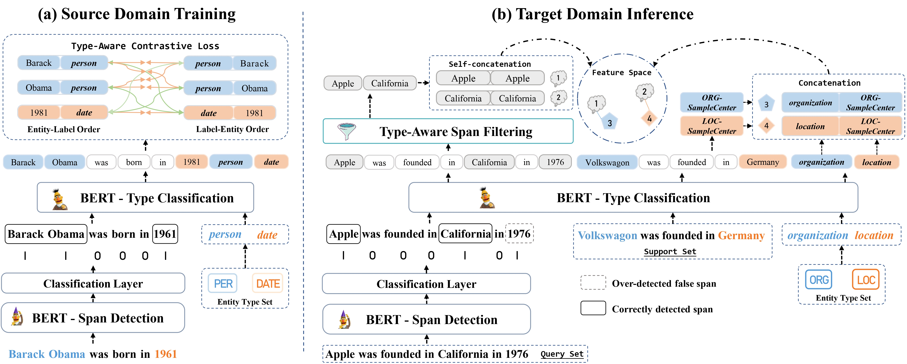

# Type-Aware Decomposed Framework for Few-Shot Named Entity Recognition

<!-- omit in toc -->
[](https://paperswithcode.com/sota/few-shot-ner-on-few-nerd-intra?p=type-aware-decomposed-framework-for-few-shot)
[](https://paperswithcode.com/sota/few-shot-ner-on-few-nerd-inter?p=type-aware-decomposed-framework-for-few-shot)


Code and data of our paper "Type-Aware Decomposed Framework for Few-Shot Named Entity Recognition" accepted by Findings of EMNLP 2023.

**Browse the code of this project more conveniently**: https://github.dev/liyongqi2002/TadNER

Paper link: [Type-Aware Decomposed Framework for Few-Shot Named Entity Recognition](https://arxiv.org/abs/2302.06397)

## Overview




## 1 Quick Start
Here we give an easy example for training and test on Domain-Transfer / FEW-NERD intra settings.
### 1.1 Environment

Python=3.8

```bash
pip install -r requirements.txt
```

### 1.2 train and test Domain Transfer CoNLL2003


```bash
bash run.sh
```

OR

```bash
bash run_fewnerd.sh
```

`Note: Due to copyright restrictions, we apologize for not being able to provide some datasets in this repository.
You can download FEW-NERD dataset at https://ningding97.github.io/fewnerd/, OntoNotes 5.0 at https://catalog.ldc.upenn.edu/LDC2013T19, I2B2 at https://portal.dbmi.hms.harvard.edu/projects/n2c2-nlp/.
Here, for your convenience, we have released a small portion of the data as an example.
`

## Citation
If you found this work helpful, please cite our paper!

```bash
@inproceedings{li-etal-2023-type-aware,
    title = "Type-Aware Decomposed Framework for Few-Shot Named Entity Recognition",
    author = "Li, Yongqi  and
      Yu, Yu  and
      Qian, Tieyun",
    booktitle = "Findings of the Association for Computational Linguistics: EMNLP 2023",
    month = dec,
    year = "2023",
    address = "Singapore",
    publisher = "Association for Computational Linguistics",
    url = "https://aclanthology.org/2023.findings-emnlp.598",
    pages = "8911--8927",
}
```


## Acknowledge

The sampled few-shot data under Domain-Transfer settings is from https://github.com/psunlpgroup/CONTaiNER, thanks for their excellent work!
